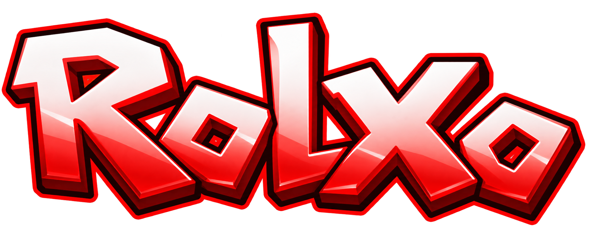

### A classic Roblox inspired game with a modern twist

**Roxlo is currently in development**

---

## About

**Roxlo** is a Roblox inspired game combining the nostalgic feel of classic Roblox with modern features and a fresh visual style.

Explore unique experiences, collect new items, use custom animations, and create your own content with **RoxStudio**.

## Features

- Classic Roblox inspired gameplay
- Custom animations
- Unique items and cosmetics
- Custom experiences
- **RoxStudio**
- Game creation tools
- Custom item creation

## RoxStudio

**RoxStudio** is Roxlo's built in creation system.

Players will be able to create their own games and design custom items, giving them the freedom to build and share their own experiences.

## Development

> 🚧 Roxlo is currently in development.

### Roadmap

- [x] Project setup
- [ ] Core gameplay
- [ ] Player customization
- [ ] Item system
- [ ] Custom animations
- [ ] RoxStudio
- [ ] Game creation
- [ ] Custom item creation
- [ ] Public release

## Screenshots

Development screenshots will be added as Roxlo progresses.

## Credits

Created by **wayaanthecoder23**

---

**Roxlo**
 
*Build. Play. Create.*

